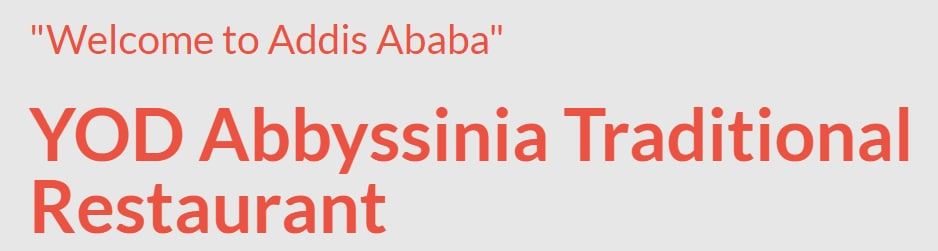

Here is a link to my loom video [Project description video](https://www.loom.com/share/289377aba29941d1a7e8d9732dc6aad7)

# First Capstone Project: Responsive Restaurant Website



> This is my capstone project built with HTML-CSS-BOOTSTRAP-JAVASCRIPT. My love for restaurants made me develop this project along that line. The website is about a popular restuarant called YOD Abbisinia restaurant. It features a list of dishes, an about page and partner sections. Please have a look at the live demo and let me know what you think 😊.

## Built With

- HTML
- CSS
- Bootstrap
- JavaScript.

## LIVE DEMO

[Live Demo Link](https://bantealem.github.io/Capstone-1/)

## Getting Started

you can clone the repository by using the command below and run the "npm install" command to install the necessary tools

 https://github.com/Bantealem/Capstone-1

### Setup

```cmd
git clone git@github.com:Bantealem/Capstone1.git
cd ./Capstone1
npm install
npm run build
npm start
```

If you are non a technical person you can download the zip file.

- To do that you have to go to the green button that says 'Code' and then press on it.
- Choose the option 'Download Zip' and wait until it download.
- Then you need to decompress it.
- You will need to have Zip compress file software installed in your computer. If you don't have it you can download it from here
- Do double click on the Capstone-1.zip and choose a folder where to place all the decompressed files.
- Once you are done decompressing, you can open the created folder.
- In it you can double click on the index.html file and choose a browser to open it (For example google Chrome Browser).
- Now you should be able to see the project.
- Remember to use the mouse to navigate through the website. Also you can use the keys 'arrow up' and 'arrow down' of your keyboard
  to scroll up and down.

## Author

👤 **Author**

- GitHub: [Bantealem](https://github.com/Bantealem)
- Twitter: [Bantealem](https://twitter.com/BantealemG)
- LinkedIn: [Bantealem](https://www.linkedin.com/in/bantealem-geto-a301b9213/)

## 🤝 Contributing

Contributions, issues, and feature requests are welcome!

## Show your support

Give a ⭐️ if you like this project!

## Acknowledgments

- [Cindy Shin](https://www.behance.net/gallery/29845175/CC-Global-Summit-2015) from who I got my inspiration.
- A great thanks to My coding partners, morning session team, and standup team Partners for their contributions.
- Thanks to Code Reviewers for the insightful feedback.


